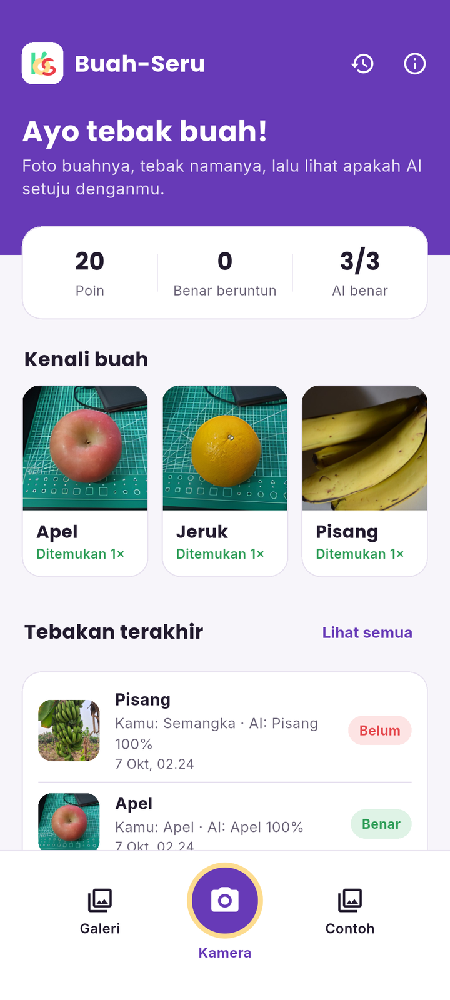
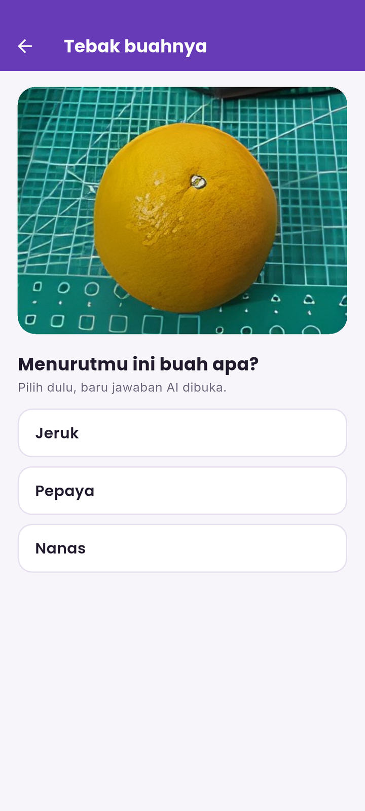
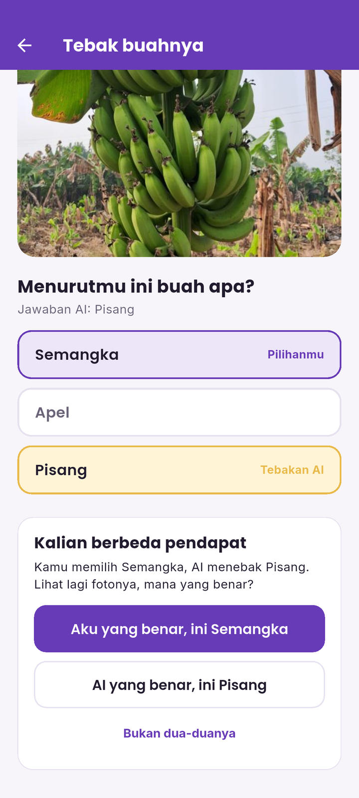
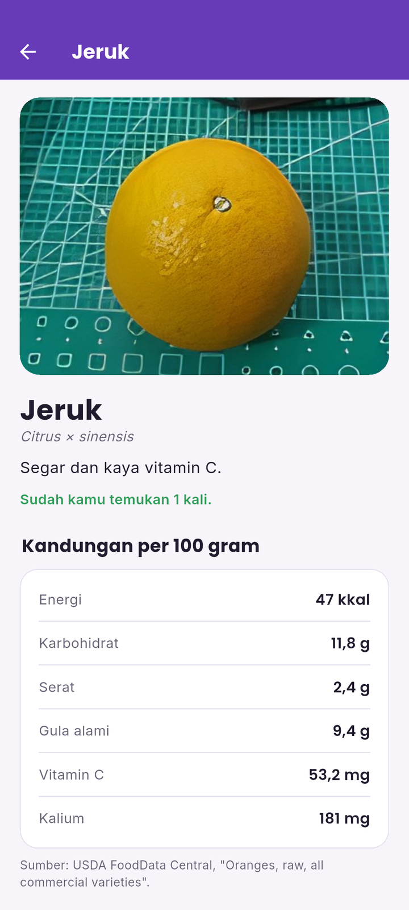
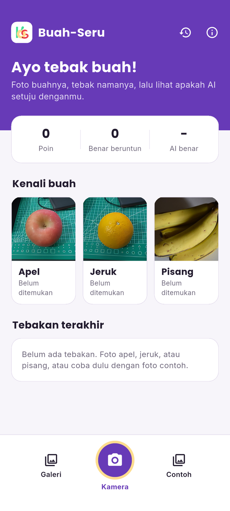
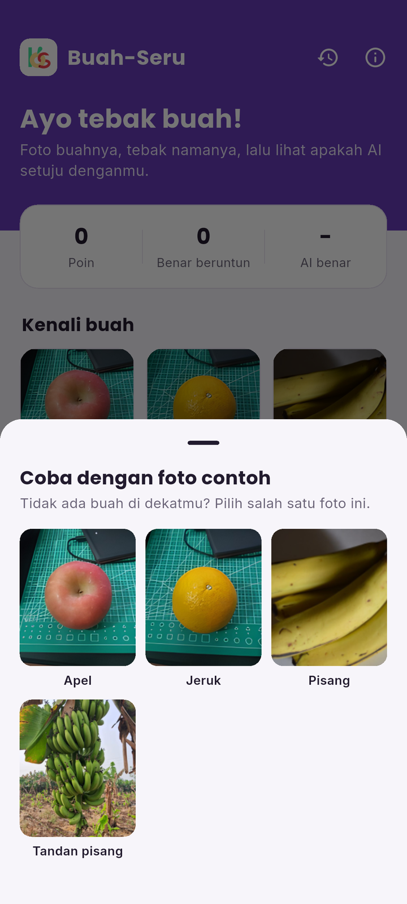
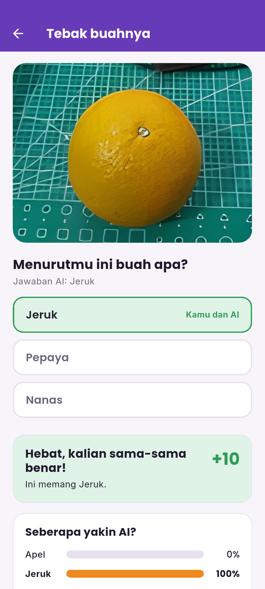
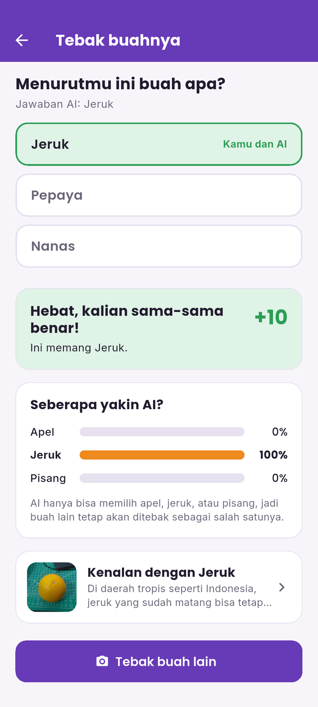
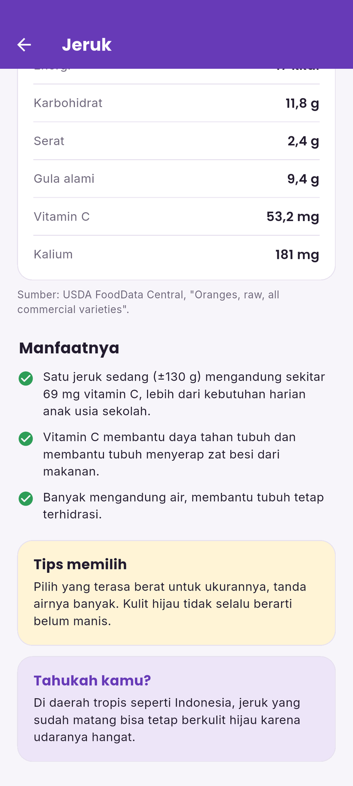
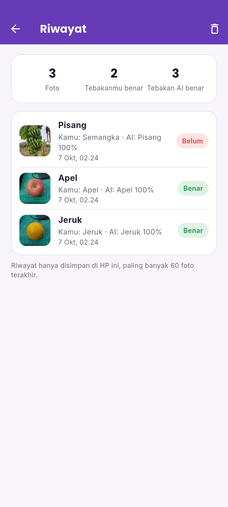

<p align="center">
  
</p>

<h1 align="center">Buah-Seru</h1>

<p align="center">
  Aplikasi Android untuk anak belajar mengenal buah, dengan CNN yang berjalan langsung di HP.<br>
  <i>An Android app that helps children learn about fruit, with a CNN running on the phone.</i>
</p>

<p align="center">
  <a href="#bahasa-indonesia">Bahasa Indonesia</a> · <a href="#english">English</a>
</p>

<table>
  <tr>
    <td align="center" width="25%"><br><sub>Beranda / Home</sub></td>
    <td align="center" width="25%"><br><sub>Tebak dulu / Guess first</sub></td>
    <td align="center" width="25%"><br><sub>Anak vs AI / Child vs AI</sub></td>
    <td align="center" width="25%"><br><sub>Kartu buah / Fruit card</sub></td>
  </tr>
</table>

---

## Bahasa Indonesia

### Tentang

Buah-Seru adalah aplikasi edukasi untuk anak. Anak memotret apel, jeruk, atau pisang, menebak namanya lebih dulu, lalu melihat apakah AI setuju. Model CNN mengenali tiga buah itu langsung di HP dengan TensorFlow Lite, tanpa internet.

Model ini selalu memilih salah satu dari tiga buah, bahkan untuk buah lain, dan sering terlalu yakin. Karena itu anak menjadi juri terakhir: bila tebakan anak dan AI berbeda, anak yang memutuskan mana yang benar, dan aplikasi mencatat seberapa sering AI benar.

### Fitur

- Kamera dengan lingkaran pemandu (seperti versi pertama), galeri, dan foto contoh untuk mencoba tanpa buah asli.
- Kuis tebak dulu: tiga pilihan jawaban, jawaban AI baru dibuka setelah anak memilih.
- Bila berbeda pendapat, anak memilih "aku yang benar", "AI yang benar", atau "bukan dua-duanya".
- Batang keyakinan AI untuk tiap buah dan peringatan bila AI kurang yakin.
- Kartu buah: kandungan gizi per 100 g (USDA FoodData Central), manfaat, tips memilih, dan fakta unik.
- Poin, benar beruntun, koleksi buah yang sudah ditemukan, dan riwayat 60 tebakan terakhir.
- Semua data (poin, riwayat, foto kecil) hanya disimpan di HP. Tidak ada akun dan tidak ada server.

### Tangkapan layar

| | | |
| --- | --- | --- |
|  |  |  |
|  |  |  |

### Model

| | |
| --- | --- |
| Arsitektur | CNN, dilatih dengan TensorFlow |
| Berkas | `assets/model/buah_cnn_258x320.tflite` |
| Masukan | `[1, 258, 320, 3]` float32, RGB dibagi 255 |
| Keluaran | `[1, 3]` softmax: apel, jeruk, pisang (`assets/model/label.txt`) |

Foto diputar sesuai EXIF, diperkecil ke 320 × 258 tanpa dipotong, lalu diproses di isolate terpisah agar layar tidak tersendat.

### Menjalankan

Butuh Flutter 3.41 atau lebih baru dan Android 7.0 (API 24) ke atas.

```bash
cd Mobile_Apps_Fruit_Detection
flutter pub get
flutter run
```

### Pengujian

```bash
cd Mobile_Apps_Fruit_Detection
flutter analyze
flutter test

# Tangkapan layar semua layar dengan model sungguhan (perlu emulator/HP):
flutter drive --driver=test_driver/integration_test.dart \
  --target=integration_test/screenshots_test.dart
```

### Struktur

```
Mobile_Apps_Fruit_Detection/
├── assets/            model, foto contoh (+ atribusi.json), logo, huruf
├── lib/
│   ├── data/          data buah dan gizi
│   ├── logic/         aturan kuis dan poin
│   ├── services/      pengklasifikasi TFLite, skor dan riwayat
│   ├── screens/       beranda, kamera, hasil, kartu buah, riwayat, tentang
│   └── widgets/
├── test/              uji unit dan widget (dengan pengklasifikasi palsu)
└── integration_test/  tangkapan layar di perangkat
```

### Sumber dan atribusi

- Data gizi: USDA FoodData Central (SR Legacy), per 100 g.
- Foto apel dan jeruk: foto tim dari uji aplikasi versi pertama, diperbesar 4× dengan Real-ESRGAN.
- Foto pisang: "Bunch of bananas" oleh Pdpics.com dan "Jalgaon Banana Bunch closeup" oleh Amol Pandharkar, keduanya CC0 dari Wikimedia Commons. Rinciannya di `assets/samples/atribusi.json`.
- Huruf: Poppins dan Inter, SIL Open Font License 1.1 (teks lisensi ada di `assets/fonts/`).

---

## English

### About

Buah-Seru is an educational app for children. The child photographs an apple, orange, or banana, guesses its name first, and then sees whether the AI agrees. A CNN recognises those three fruits on the phone with TensorFlow Lite, without internet.

The model always picks one of the three fruits, even for other fruit, and is often over-confident. So the child is the final judge: when the child and the AI disagree, the child decides who is right, and the app keeps track of how often the AI was correct.

### Features

- Camera with a circular guide (as in the first version), gallery, and sample photos for trying it without real fruit.
- Guess-first quiz: three options, and the AI answer is only revealed after the child picks.
- On disagreement the child chooses "I'm right", "the AI is right", or "neither".
- AI confidence bars for each fruit and a warning when the AI is unsure.
- Fruit cards: nutrition per 100 g (USDA FoodData Central), benefits, buying tips, and a fun fact.
- Points, streaks, a collection of fruit found, and a history of the last 60 guesses.
- All data (points, history, thumbnails) stays on the phone. No account and no server.

### Model

| | |
| --- | --- |
| Architecture | CNN trained with TensorFlow |
| File | `assets/model/buah_cnn_258x320.tflite` |
| Input | `[1, 258, 320, 3]` float32, RGB divided by 255 |
| Output | `[1, 3]` softmax: apple, orange, banana (`assets/model/label.txt`) |

Photos are rotated according to EXIF, resized to 320 × 258 without cropping, and processed in a separate isolate so the UI stays smooth.

### Running

Requires Flutter 3.41 or newer and Android 7.0 (API 24) or later.

```bash
cd Mobile_Apps_Fruit_Detection
flutter pub get
flutter run
```

### Testing

```bash
cd Mobile_Apps_Fruit_Detection
flutter analyze
flutter test

# Screenshots of every screen with the real model (needs an emulator/phone):
flutter drive --driver=test_driver/integration_test.dart \
  --target=integration_test/screenshots_test.dart
```

### Credits

- Nutrition data: USDA FoodData Central (SR Legacy), per 100 g.
- Apple and orange photos: the team's own photos from testing the first version, upscaled 4× with Real-ESRGAN.
- Banana photos: "Bunch of bananas" by Pdpics.com and "Jalgaon Banana Bunch closeup" by Amol Pandharkar, both CC0 from Wikimedia Commons. Details in `assets/samples/atribusi.json`.
- Fonts: Poppins and Inter, SIL Open Font License 1.1 (license texts in `assets/fonts/`).
