<p align="center">
  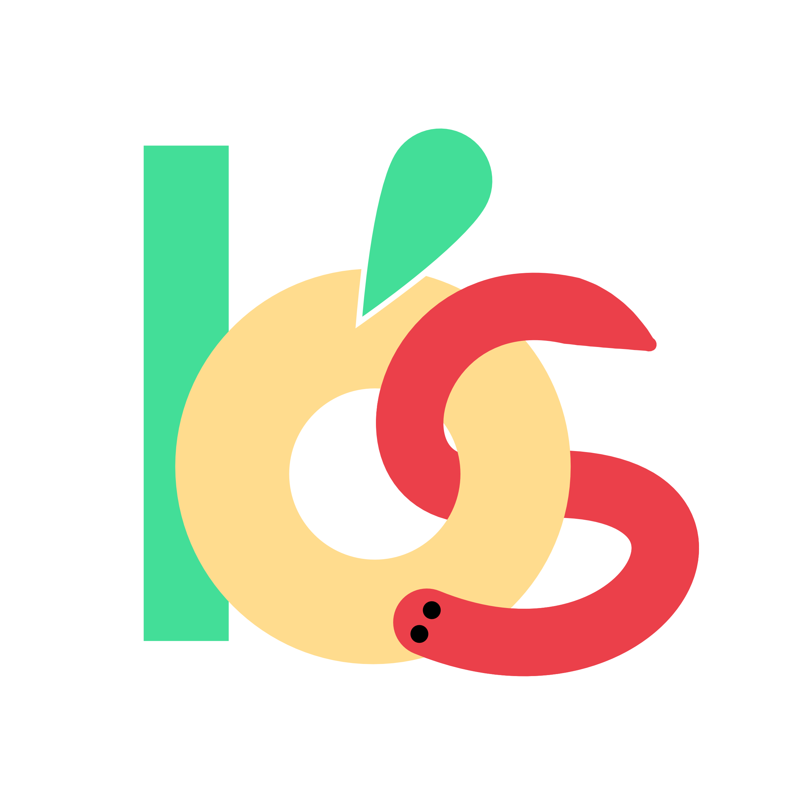
</p>

<h1 align="center">Buah-Seru</h1>

<p align="center">
  Aplikasi Android untuk membantu anak mengenal buah, dengan model CNN yang berjalan langsung di ponsel.<br>
  <i>An Android app that helps children learn about fruit, with a CNN that runs directly on the phone.</i>
</p>

<p align="center">
  <a href="#bahasa-indonesia">Bahasa Indonesia</a> · <a href="#english">English</a>
</p>

<p align="center">
  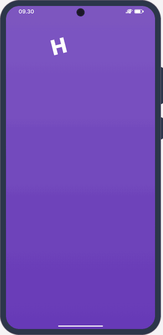
</p>

<table>
  <tr>
    <td align="center" width="25%">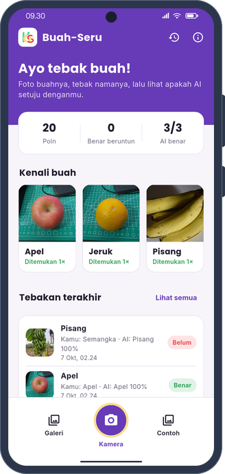<br><sub>Beranda / Home</sub></td>
    <td align="center" width="25%">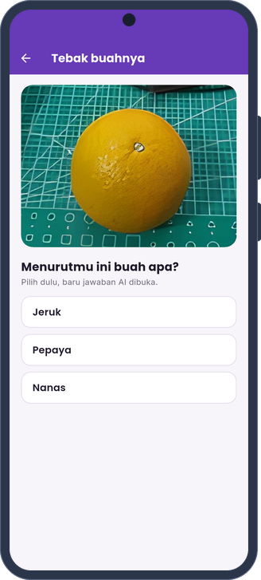<br><sub>Tebak dulu / Guess first</sub></td>
    <td align="center" width="25%">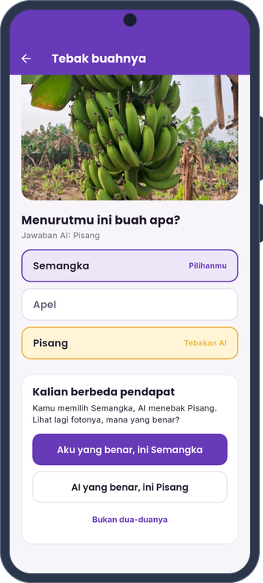<br><sub>Anak dan AI / Child and AI</sub></td>
    <td align="center" width="25%">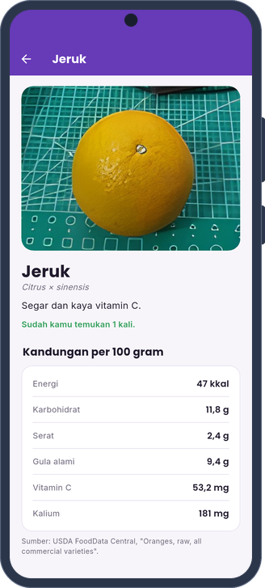<br><sub>Kartu buah / Fruit card</sub></td>
  </tr>
</table>

---

## Bahasa Indonesia

### Tentang

Buah-Seru adalah aplikasi edukasi yang mengajak anak mengenal buah melalui permainan menebak. Anak memotret apel,
jeruk, atau pisang, menebak namanya terlebih dahulu, kemudian melihat apakah kecerdasan buatan sependapat. Pengenalan
buah dilakukan oleh model CNN yang berjalan langsung di ponsel dengan TensorFlow Lite, sehingga aplikasi dapat dipakai
tanpa koneksi internet.

Model tersebut selalu memilih salah satu dari tiga buah, termasuk ketika foto berisi buah lain, dan sering kali
terlalu yakin terhadap jawabannya. Oleh karena itu, anak ditempatkan sebagai penentu akhir. Ketika tebakan anak
berbeda dengan jawaban AI, anaklah yang memutuskan jawaban yang benar, sementara aplikasi mencatat seberapa sering AI
menjawab dengan tepat. Dengan cara ini, anak belajar bahwa AI dapat keliru dan perlu diperiksa.

### Fitur

Foto buah dapat diambil dengan kamera yang dilengkapi lingkaran pemandu, dipilih dari galeri, atau diganti dengan foto
contoh bagi anak yang ingin mencoba tanpa buah asli. Setiap foto diawali kuis tebak dulu dengan tiga pilihan jawaban,
dan jawaban AI baru ditampilkan setelah anak memilih. Apabila keduanya berbeda pendapat, anak diajak melihat fotonya
sekali lagi dan masih boleh mengganti pilihannya, atau menyatakan bahwa dirinya benar, bahwa AI yang benar, atau bahwa
keduanya keliru. Poin hanya diberikan untuk tebakan pertama yang benar, sehingga jawaban AI tidak dapat sekadar
disalin. Batang keyakinan menunjukkan seberapa yakin AI
terhadap setiap buah, disertai peringatan ketika keyakinannya rendah.

Setiap buah memiliki kartu yang memuat kandungan gizi per 100 gram dari USDA FoodData Central, manfaat, tips memilih,
dan satu fakta menarik. Kemajuan anak tercatat melalui poin, jumlah jawaban benar berturut-turut, koleksi buah yang
sudah ditemukan, serta riwayat 60 tebakan terakhir. Seluruh data tersebut, termasuk foto kecil hasil tebakan, hanya
disimpan di ponsel; aplikasi tidak memerlukan akun dan tidak mengirim data ke server.

Saat dibuka, huruf "Halo!" jatuh dan memantul di layar ungu, lalu layar ungu terangkat seperti tirai. Setelah itu apel,
jeruk, dan pisang jatuh ke tengah layar dan melompat bergantian sementara model CNN dimuat. Anak dapat mengetuk buahnya: buah yang diketuk melompat tinggi sambil berputar, dan ulat kecil keluar
dari lubang apel. Karena model sudah dimuat selama pembuka, tebakan pertama tidak perlu menunggu lama.

### Tangkapan layar

| | | |
| :---: | :---: | :---: |
| 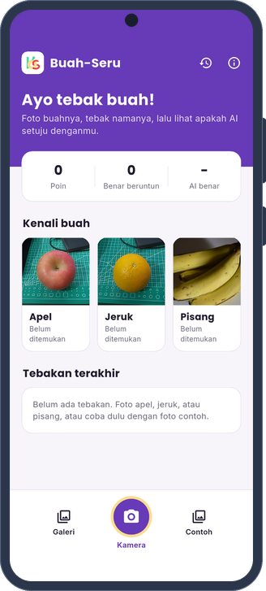 | 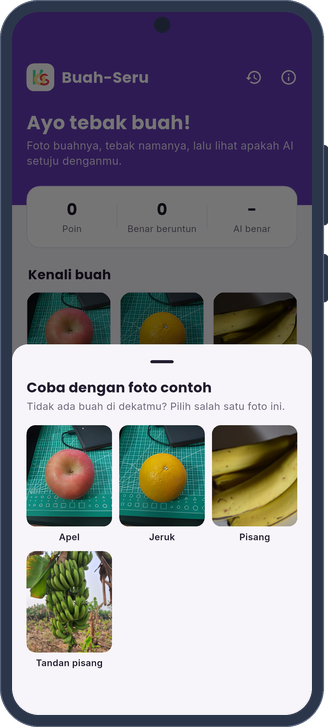 | 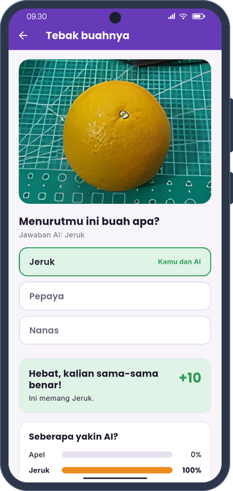 |
| Beranda | Foto contoh | Hasil tebakan |
| 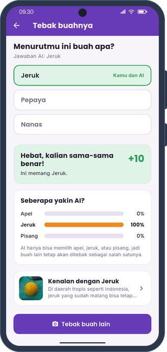 | 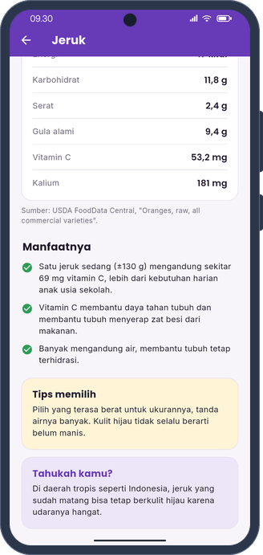 | 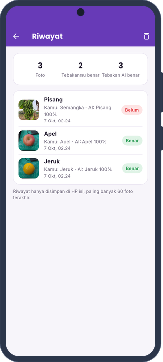 |
| Keyakinan AI | Kandungan gizi | Riwayat |

Bingkai ponsel pada tangkapan layar digambar sendiri dengan skrip `phone_frame.py` dari repo
[MEIRA](https://github.com/khaichi11/MEIRA) (Apache-2.0), tanpa memakai templat perangkat dari pihak lain.

### Model

| | |
| --- | --- |
| Arsitektur | CNN yang dilatih dengan TensorFlow |
| Berkas | `assets/model/buah_cnn_258x320.tflite` |
| Masukan | `[1, 258, 320, 3]` float32, nilai RGB dibagi 255 |
| Keluaran | `[1, 3]` softmax untuk apel, jeruk, dan pisang (`assets/model/label.txt`) |

Sebelum diklasifikasikan, foto diputar sesuai data EXIF dan diperkecil menjadi 320 × 258 piksel tanpa dipotong.
Seluruh proses ini berjalan di isolate terpisah agar tampilan tetap lancar.

### Menjalankan

Aplikasi memerlukan Flutter 3.41 atau versi yang lebih baru serta Android 7.0 (API 24) ke atas.

```bash
cd Mobile_Apps_Fruit_Detection
flutter pub get
flutter run
```

### Pengujian

Analisis statis dan uji unit dijalankan dengan perintah berikut. Uji unit memakai pengklasifikasi tiruan, sehingga
tidak memerlukan model atau perangkat. Uji integrasi di bagian akhir mengambil tangkapan layar setiap halaman dengan
model sungguhan dan memerlukan emulator atau ponsel.

```bash
cd Mobile_Apps_Fruit_Detection
flutter analyze
flutter test

flutter drive --driver=test_driver/integration_test.dart \
  --target=integration_test/screenshots_test.dart
```

GIF demo di bagian atas dirender di laptop tanpa emulator. Uji `demo_render_test.dart` menggambar setiap layar dengan
pengklasifikasi tiruan dan menyimpan bingkainya, lalu `tool/render_gif.py` menyusunnya ke dalam bingkai ponsel.

```bash
DEMO_FRAMES=build/frames flutter test test/demo_render_test.dart
python3 tool/render_gif.py build/frames docs/demo.gif
```

### Struktur

```
Mobile_Apps_Fruit_Detection/
├── assets/            model, foto contoh beserta atribusi.json, logo, dan huruf
├── lib/
│   ├── data/          data buah dan kandungan gizi
│   ├── logic/         aturan kuis dan poin
│   ├── services/      pengklasifikasi TFLite, skor, dan riwayat
│   ├── screens/       beranda, kamera, hasil, kartu buah, riwayat, dan tentang
│   └── widgets/
├── test/              uji unit dan widget dengan pengklasifikasi tiruan
└── integration_test/  pengambilan tangkapan layar di perangkat
```

### Sumber dan atribusi

- Data gizi berasal dari USDA FoodData Central (SR Legacy) dan dinyatakan per 100 gram.
- Foto apel dan jeruk merupakan foto tim dari uji aplikasi versi pertama yang diperbesar empat kali dengan
  Real-ESRGAN.
- Foto pisang adalah "Bunch of bananas" karya Pdpics.com dan "Jalgaon Banana Bunch closeup" karya Amol Pandharkar,
  keduanya berlisensi CC0 dari Wikimedia Commons. Rinciannya tercantum di `assets/samples/atribusi.json`.
- Huruf Poppins dan Inter memakai SIL Open Font License 1.1; teks lisensinya tersedia di `assets/fonts/`.

---

## English

### About

Buah-Seru is an educational app that introduces children to fruit through a guessing game. The child photographs an
apple, an orange, or a banana, guesses its name first, and then finds out whether the AI agrees. Recognition is done by
a CNN that runs directly on the phone with TensorFlow Lite, so the app works without an internet connection.

The model always picks one of the three fruits, even when the photo shows a different fruit, and it is often more
confident than it should be. For that reason the child is the final judge. When the child and the AI disagree, the
child decides which answer is correct, and the app keeps track of how often the AI was right. In this way children
learn that AI can be wrong and needs to be checked.

### Features

A photo can be taken with the camera, which shows a circular guide, picked from the gallery, or replaced by a sample
photo for children who want to try the app without real fruit. Every photo starts with a guess-first quiz that offers
three answers, and the AI's answer is revealed only after the child has chosen. When the two disagree, the child is
invited to look at the photo again and may still change the answer, or can say that they are right, that the AI is
right, or that neither is. Points are given only for a correct first guess, so the AI's answer cannot simply be
copied. Confidence bars show how sure the AI is about each
fruit, with a warning when its confidence is low.

Each fruit has a card with its nutrition per 100 grams from USDA FoodData Central, its benefits, buying tips, and a
fun fact. Progress is recorded through points, correct-answer streaks, a collection of the fruit found so far, and a
history of the last 60 guesses. All of this data, including the small photos from each guess, stays on the phone; the
app needs no account and sends nothing to a server.

On launch the letters of "Halo!" drop and bounce on a purple screen, which then lifts away like a curtain. An apple, an
orange, and a banana fall into the middle of the screen and take turns hopping while the CNN loads. The child can tap them: the tapped fruit jumps high and spins, and a small
caterpillar peeks out of the hole in the apple. Because the model loads during the opening, the first guess does not
keep the child waiting.

### Screenshots

| | | |
| :---: | :---: | :---: |
|  |  |  |
| Home | Sample photo | Guess result |
|  |  |  |
| AI confidence | Nutrition | History |

The phone frames are drawn with the `phone_frame.py` script from the [MEIRA](https://github.com/khaichi11/MEIRA)
repository (Apache-2.0); no third-party device mockups are used.

### Model

| | |
| --- | --- |
| Architecture | CNN trained with TensorFlow |
| File | `assets/model/buah_cnn_258x320.tflite` |
| Input | `[1, 258, 320, 3]` float32, RGB values divided by 255 |
| Output | `[1, 3]` softmax for apple, orange, and banana (`assets/model/label.txt`) |

Before classification, each photo is rotated according to its EXIF data and resized to 320 × 258 pixels without
cropping. The whole step runs in a separate isolate so the interface stays smooth.

### Running

The app requires Flutter 3.41 or newer and Android 7.0 (API 24) or later.

```bash
cd Mobile_Apps_Fruit_Detection
flutter pub get
flutter run
```

### Testing

The commands below run static analysis and the unit tests. The unit tests use a fake classifier, so they need neither
the model nor a device. The integration test at the end captures every screen with the real model and needs an
emulator or a phone.

```bash
cd Mobile_Apps_Fruit_Detection
flutter analyze
flutter test

flutter drive --driver=test_driver/integration_test.dart \
  --target=integration_test/screenshots_test.dart
```

The demo GIF at the top is rendered on a laptop without an emulator. The test `demo_render_test.dart` draws every
screen with a fake classifier and saves the frames, and `tool/render_gif.py` then places them in a phone frame.

```bash
DEMO_FRAMES=build/frames flutter test test/demo_render_test.dart
python3 tool/render_gif.py build/frames docs/demo.gif
```

### Credits

- Nutrition data comes from USDA FoodData Central (SR Legacy) and is given per 100 grams.
- The apple and orange photos were taken by the team while testing the first version and were upscaled four times
  with Real-ESRGAN.
- The banana photos are "Bunch of bananas" by Pdpics.com and "Jalgaon Banana Bunch closeup" by Amol Pandharkar, both
  CC0 from Wikimedia Commons. Details are listed in `assets/samples/atribusi.json`.
- The Poppins and Inter fonts use the SIL Open Font License 1.1; the license texts are in `assets/fonts/`.
